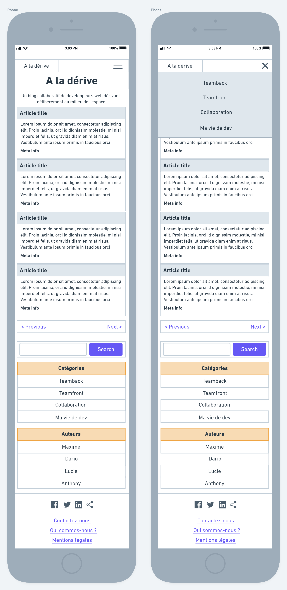

# Projet O'Blog

Ca y est ! On vous confie la réalisation d'un projet ! Pas trop tôt :muscle:

C'est donc parti pour le projet **O'Blog** !

## Objectif

L'objectif est de **réaliser l'intégration de la page d'accueil du blog** de notre client. Vous pourrez vous baser sur un **cahier des charges** ainsi que sur des **wireframes** produits pour l'occasion.

## Organisation

L'atelier se déroulant l'après-midi, il se peut que l'équipe de PairProgramming devienne 2 équipes de un après 15h.  
Ce n'est pas grave. L'atelier n'oblige pas à avoir 2 cerveaux, tout le temps.  
Et d'ailleurs, en cas de "séparation" (à l'amiable on l'espère :wink:), vous pouvez toujours vous entraider via slack et/ou discord.

## Exercice

### 1. Un petit quiz

Que diriez-vous de commencer par un petit quiz à propos du **cahier des charges** ? Histoire de vérifier si vous avez bien compris la demande :nerd_face:

Vous pourrez le trouver [sur votre drive](#). N'hésitez pas à bien relire le CDC pour vérifier vos réponses !

> Le quiz a une correction intégrée, visible après avoir validé ^^

### 2. Maquettage

En utilisant les wireframes fournis, on vous demande de **réaliser des maquettes graphiques** :tada:

Au programme :

* :mag_right: Analyser les documents fournis pour appuyer votre travail. Les **wireframes** vont particulièrement vous intéresser, mais le **CDC** peut aussi aider !
* :iphone: Penser au _mobile-first_ et au _responsive design_ !
* :hammer: Construire la structure HTML de la page d'accueil (sans les liens de pagination, ni les icônes du footer)
* :wrench: Utiliser Bootstrap et ses composants (voir le [guide fourni](guide_bootstrap.md)) pour réaliser une première intégration. On n'utilisera **pas de CSS perso** dans l'idéal, mais seulement Bootstrap, afin de créer une _base de travail_ pour la suite de l'intégration.

## Bonus

* Ajouter la pagination en dessous de la liste des articles avec le composant **Pagination**.
* Ajouter les icônes des réseaux sociaux dans le footer.

Pour les icônes, vous pouvez vous intéresser à l'utilisation de [Font Awesome](https://fontawesome.com/v4.7.0/) ! Ce petit _toolkit_ vous permettra d'utiliser des icônes en tant que **police de caractère**, ce qui autorise notamment l'utilisation du CSS dessus :)

Il en existe d'autres : [fontello](http://fontello.com/), [Ionicons](https://ionicons.com/)...

## Ressources

### Cahier des charges

[Vous trouverez le cahier des charges ici](cdc/cdc-blog.md) ! Faites-en bon usage.

### Wireframes

